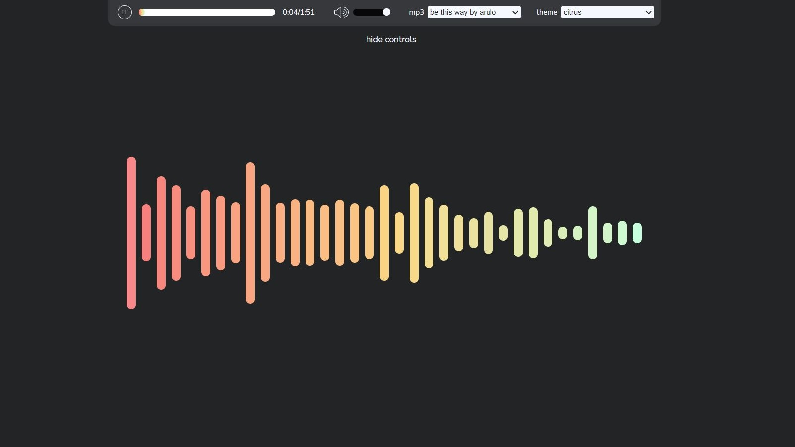
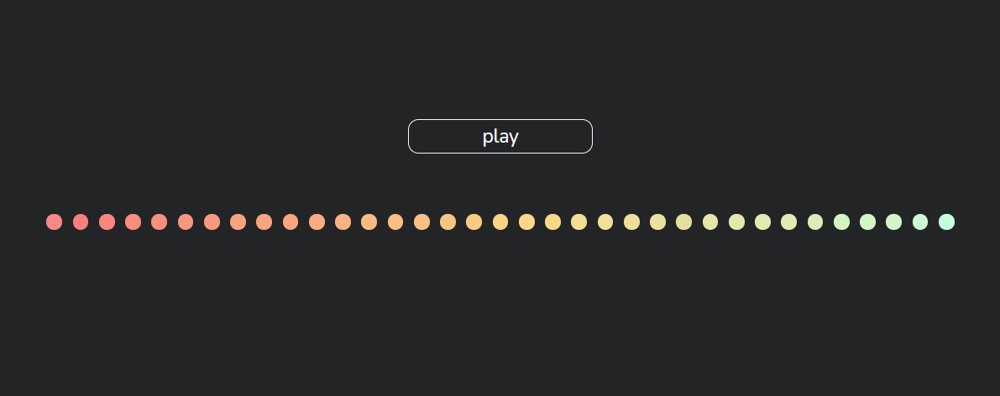
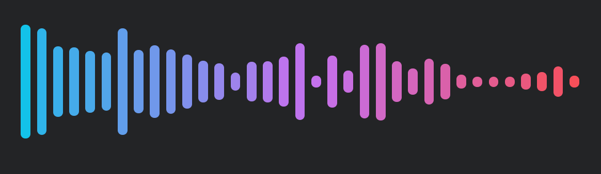
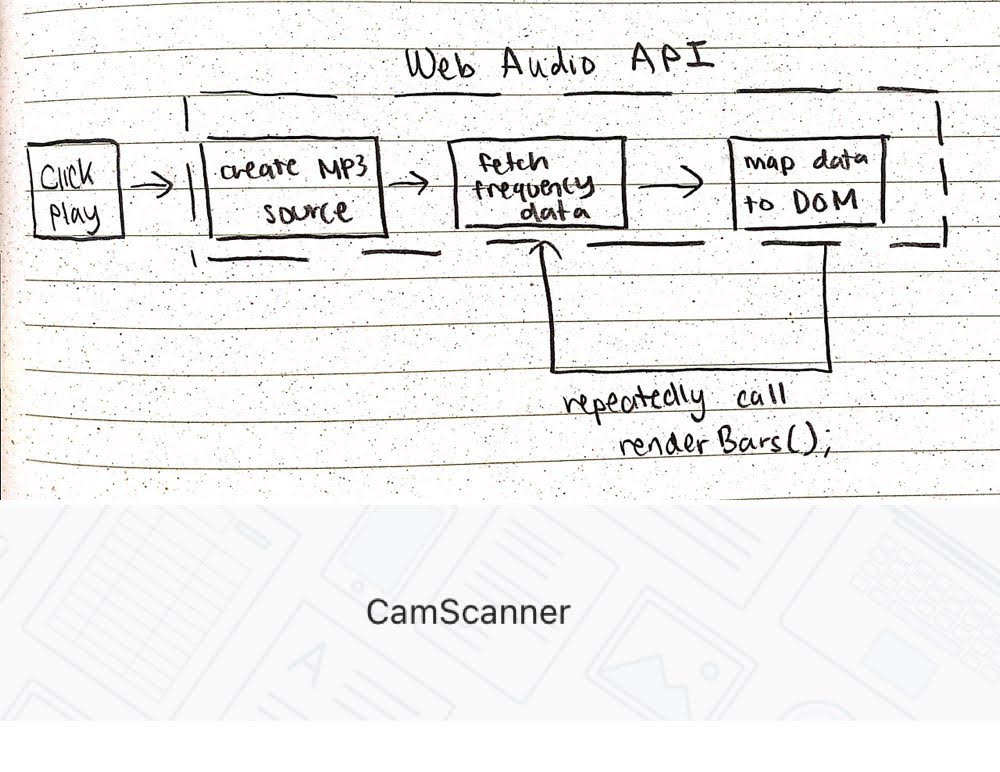
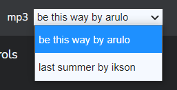
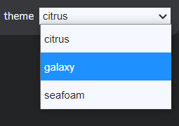

<h1 align="center">Audio Frequency Visualizer</h1>
<h2 align="center"><a  href="https://chloe-trn.github.io/audio-frequency-visualizer/">Live Demo</a></h2>

 An audio visualizer composed of vertical bars. The height of the bars represent the frequency intensity from low frequencies (left bars) to high frequencies (right bars) as the audio plays. 

## Table of Contents

- [Table of contents](#table-of-contents)
- [Tools Used](#tools-used)
- [Features](#features)
  - [Start Screen](#start-screen)
  - [Audio Bars](#audio-bars)
  - [Audio Player Controls](#audio-player-controls)
  - [Volume Control](#volume-control)
  - [MP3 Selection](#mp3-selection)
  - [Color Theme Selection](#color-theme-selection)
- [Future Work](#future-work)

## Tools Used

 

* This website is created with JavaScript [ES6 syntax], and CSS, and HTML. 
* This website is deployed on GitHub Pages.
* Royalty free audio is sourced from Mixkit.co.

## Features
### Start Screen 

* Application sound playback initializes with a play button.
* This is to meet the Chrome Autoplay policy which the Web Audio API enforces: https://developers.google.com/web/updates/2017/09/autoplay-policy-changes

### Audio Bars

* The audio bars represent frequencies of the current audio source, from low frequencies to high frequencies going left to right. 
* The height of the bars indicate the strength of frequency. 
* The Web Audio API context node system was used to pull out the audio frequency data at a specific moment in time. 
* A renderBars() function continually fetches audio frequency data, simulating the audio bars to move with the beat of the music. 
* A flow chart outlining the general logic behind the audio bar functionality is shown below: 

### Audio Player Controls

* The current MP3 audio can be paused, played, and the user can click to a certain time stamp. 
* The total length of the song and it's current time stamp is displayed. 
### Volume Control 

 

* The current MP3 audio can be muted, unmuted, or volume adjusted. 

### MP3 Selection 

* There are 2 MP3 selections. 
### Color Theme Selection 

* There are 3 gradient color theme selections, that will apply to the audio bars and audio player controls. 

## Future Work
* Responsiveness down to mobile devices.
