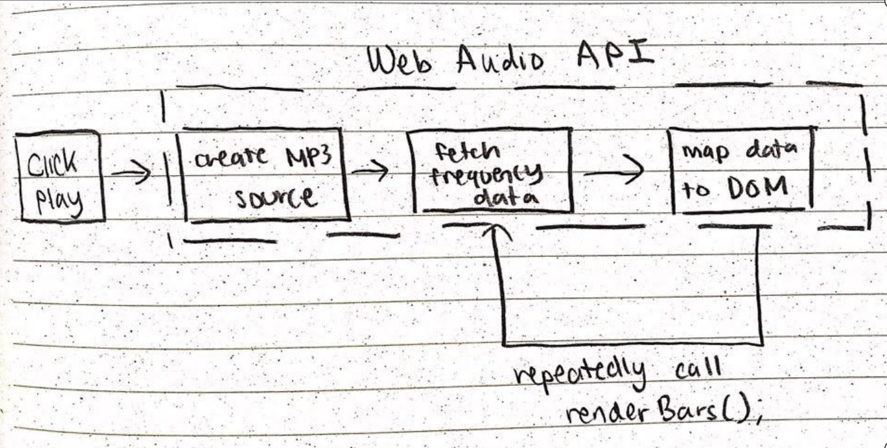

<h1 align="center">Audio Visualizer</h1>

A visually engaging simulation that represents audio signals through vibrant vertical bars, with each bar's height corresponding to the intensity of a specific frequency as the audio is played.

<a href="https://audio-frequency-visualizer.netlify.app/">Live Demo</a>

 

## Features
### Start Screen 

* Application sound playback initializes with a play button.
* This is to meet the Chrome Autoplay policy which the Web Audio API enforces: https://developers.google.com/web/updates/2017/09/autoplay-policy-changes

### Audio Bars

* The audio bars represent frequencies of the current audio source, from low frequencies to high frequencies going left to right. 
* The height of the bars indicate the strength of frequency. 
* The Web Audio API context node system was used to pull out the audio frequency data at a specific moment in time. 
* A renderBars() function continually fetches audio frequency data, simulating the audio bars to move with the beat of the music. 
* A flow chart outlining the general logic behind the audio bar functionality is shown below: 

### Audio Player Controls

* The current MP3 audio can be paused, played, and the user can skip around to different time stamps.
* The total length of the song and its current time stamp is displayed. 
### Volume Control 

 

* The current MP3 audio can be muted, unmuted, or volume adjusted. 

### MP3 Selection 

* There are 2 MP3 selections. 
### Color Theme Selection 

* There are 3 gradient color theme selections, that will apply to the audio bars and audio player controls. 
